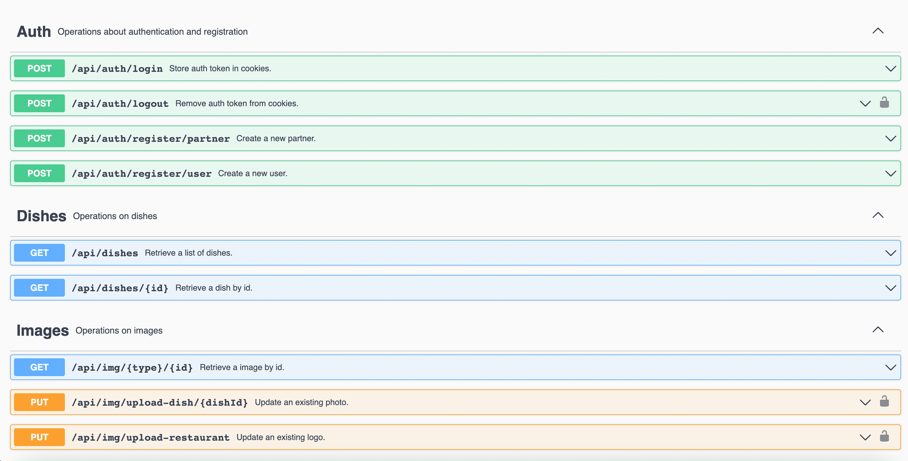
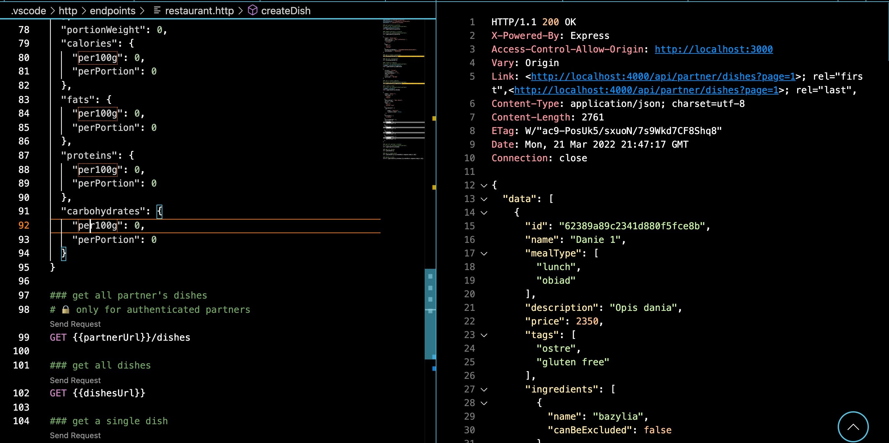

# CodersCamp 2021 - Projekt Node.js

<div align="center">

[](https://coderscamp2021-hk.github.io/CodersCamp2021.Project.JavaScript/)
[](https://www.figma.com/file/2tFkNLS337vqoDmRMBYT7u/Project.JavaScript?node-id=5%3A1457)
[](https://app.codecov.io/gh/CodersCamp2021-HK/CodersCamp2021.Project.JavaScript)

</div>
🍲🍝🍜 **BierzCoChcesz** 🍲🍝🍜 - projekt skierowany do ludzi, którzy nie lubią gdy narzuca im się wybory jedzeniowe a jednocześnie zwracają uwagę na wartości odżywcze swoich posiłków.
Aplikacja pozwala na skomponowanie przez użytkownika diety na cały dzień składającej się z dań z ulubionych restauracji. W praktyce to system partnerski zrzeszający najlepsze restauracje.

<br/>
<br/>

## 🖥️ Użyte technologie
<br/>

### Główne:
 - [Docker](https://docs.docker.com/get-docker/)
 - [MongoDB](https://www.mongodb.com/)
 - [Mongoose](https://mongoosejs.com/)
 - [NestJS](https://nestjs.com/)
 - [Express](https://expressjs.com/)
 - [Nodemailer](https://nodemailer.com/)
 - [Swagger](https://swagger.io/tools/swaggerhub/?&utm_medium=ppcg&utm_source=aw&utm_term=swagger&utm_content=511173019632&utm_campaign=SEM_SwaggerHub_PR_EMEA_ENG_EXT_Prospecting&awsearchcpc=1&gclid=CjwKCAjwxOCRBhA8EiwA0X8hiwxh7NHt37o-DaApRMBtiZ25QonxHVTKTew0Pa2SYAC6nDVzJnYD3xoCejMQAvD_BwE&gclsrc=aw.ds)
 - [Figma](https://www.figma.com/files/recent?fuid=1047244325467558592)

<br/>

### Pomocnicze:
- TypeSript
- Yarn
- Jest
- ESLint
- VS Code
- Git
- GitHub
- Figma 
- PassportJWT
- REST Client
<br/>
<br/>

## ⚙️ Instalacja projektu
Do przygotowania środowiska dev użyliśmy m.in. [Dockera](https://docs.docker.com/get-docker/), więc zakładamy, że jest on wcześniej zainstalowany i skonfigurowany. 
<br/>
<br/>

#### Instalacja i urochomienie projektu z wykorzystaniem `yarn`

```bash
yarn install
docker-compose up
```

Obserowanie zmian w środowisku dev:
```bash
yarn dev
```

Wygenerowanie plików produkcyjnych:
```bash
yarn build
```
<br/>

#### Pozostałe komendy

Sprawdzenie projektu za pomocą [ESLint](https://eslint.org/):
```bash
yarn lint
```
Uruchomienie testów jednostkowych:
```bash
yarn test:unit
```
Uruchomienie testów e2e:
```bash
yarn test:e2e
```
<br/>
<br/>

## 📢 Wykonywanie zapytań / testowanie  endpointów 📣

### Swagger
Zbiór wszystkich dostępnych zapytań widocznych z poziomu przeglądarki.
<br/>
<figure>
    
    <figcaption>Przykładowy widok</figcaption>
</figure>

### REST Client
Rozszerzenie do VSCode, które pozwala na wykonywanie zapytań z poziomu edytora kodu.
<br/>
<figure>
    
    <figcaption>Przykładowy widok</figcaption>
</figure>

<br/>
<br/>

## 👨‍💻 Autorzy 👩‍💻

**Mentor**: [@htk4](https://github.com/htk4)

Scrum Master: [@mmejer](https://github.com/mmejer)

Project Manager: [@jskrajna](https://github.com/jskrajna)

Tech Lead: [@KamilDudek](https://github.com/KamilDudek)

Po trochę z każdej roli: [@tchojnacki](https://github.com/tchojnacki)

