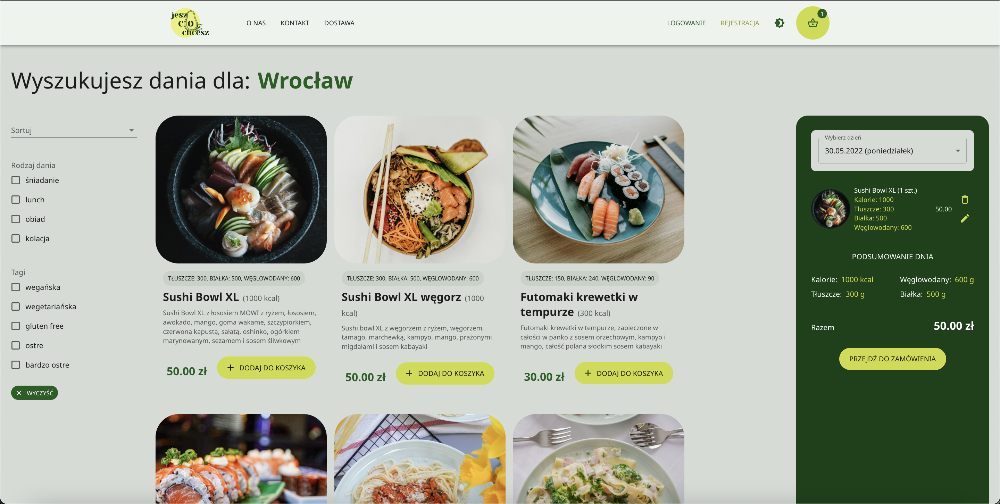
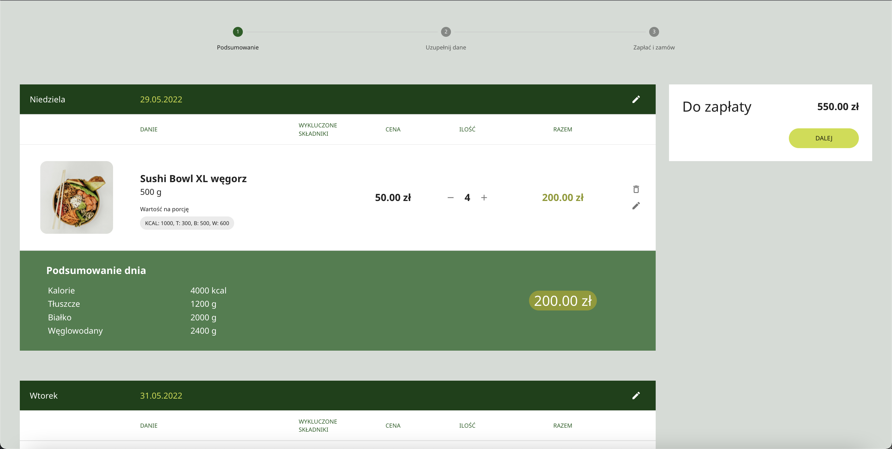
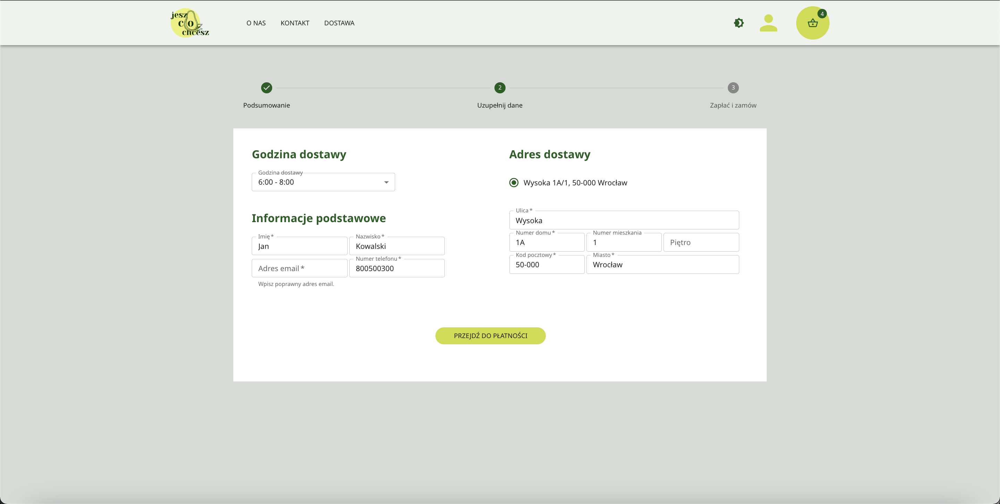
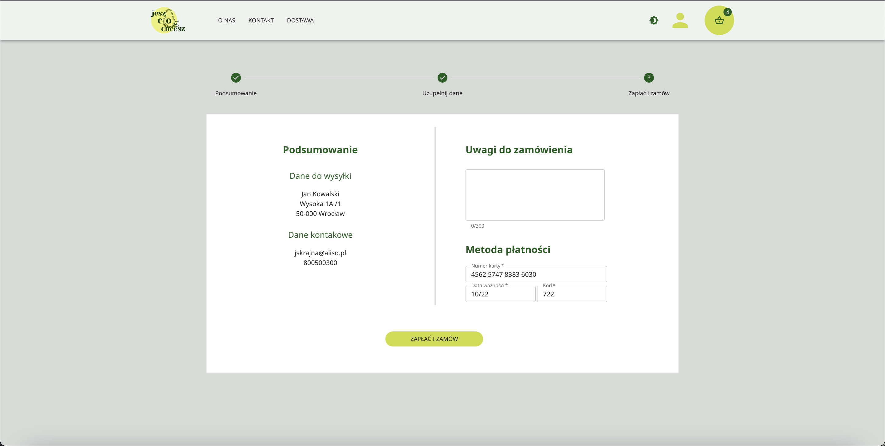

# CodersCamp 2021 - Projekt Fullstack

<div align="center">

[](https://coderscamp2021-hk-fullstack.herokuapp.com/)
[](https://app.codecov.io/gh/CodersCamp2021-HK/CodersCamp2021.Project.Fullstack)
[](https://www.figma.com/file/51gzaCTbilz6X9r0PZxmhX/Project.Fullstack?node-id=0%3A1)
[](https://www.figma.com/file/Cwxh4WHHLxBhhyxJQIgsI9/Project.Fullstack?node-id=10%3A13)

</div>

<br/>

<p>
🍲🍝🍜 <strong>JeszCoChcesz</strong> 🍲🍝🍜 catering skierowany do ludzi, którzy nie lubią, gdy narzuca im się wybory jedzeniowe, a jednocześnie dbają o zbilansowane odżywianie. Aplikacja wyliczy dla Ciebie wartości odżywcze Twoich posiłków, dzięki czemu będziesz mógł jeść ulubione dania przy jednoczesnym trzymaniu się wyznaczonej diety. Skomponuj swoje menu z dań z ulubionych restauracji, a my dostarczymy Ci zamówienie pod same drzwi. To także system partnerski zrzeszający najlepsze restauracje w Twoim mieście.</p>

<br/>
<br/>

## 🖥️ Użyte technologie

<br/>

### Główne:

- [React](https://pl.reactjs.org/)
- [TypeScript](https://www.typescriptlang.org/docs/)
- [Docker](https://docs.docker.com/get-docker/)
- [MongoDB](https://www.mongodb.com/)
- [Mongoose](https://mongoosejs.com/)
- [NestJS](https://nestjs.com/)
- [Express](https://expressjs.com/)
- [Nodemailer](https://nodemailer.com/)
- [Swagger](https://swagger.io/tools/swaggerhub)

<br/>

### Pomocnicze:

- Yarn
- Jest
- ESLint
- VS Code
- Git
- GitHub
- Figma
- PassportJWT
- REST Client
- Immer
- React Router

  <br/>
  <br/>

## ⚙️ Instalacja projektu

<br/>

Do przygotowania środowiska dev użyliśmy m.in. [Dockera](https://docs.docker.com/get-docker/), więc zakładamy, że jest on wcześniej zainstalowany i skonfigurowany.
<br/>
<br/>

### Instalacja i uruchomienie projektu z wykorzystaniem `yarn`

```bash
yarn install
docker-compose up
```

Uruchomienie serwera developerskiego. Aplikacja będzie dostępna pod adresem lokalnym (front - http://localhost:3000 oraz API - http://localhost:4000/api):

```bash
yarn dev
```

Wygenerowanie plików produkcyjnych:

```bash
yarn build
```

<br/>

### Pozostałe komendy

Sprawdzenie projektu za pomocą [ESLint](https://eslint.org/):

```bash
yarn lint
```

Uruchomienie wszystkich testów:

```bash
yarn test
```

<br/>
<br/>

## Korzystanie z aplikacji

<br/>

Osoba niezalogowana ma dostęp do listy restauracji i dań. Ponadto dania i restauracje może filtrować na podstawie miasta, rodzaju kuchni, rodzaju posiłku i tagów.
Aby w pełni korzystać z aplikacji, należy założyć konto i się zalogować. Istnieje możliwość rejestracji jako restauracja partnerska (`Partner`) i zwykły użytkownik (`User`).

**`Partner` – restauracja partnerska**

1. Rejestruje się podając email oraz NIP i ustawiając hasło.

2. Po rejestracji i zalogowaniu uzupełnia profil (nazwa restauracji, opis, logo, tagi, adres(y), telefon).

3. Po uzupełnieniu profilu partner może dodawać dania (nazwa, opis dania, tagi, lista składników, alergeny, kaloryczność, wartości odżywcze).

4. Partner może edytować i usuwać dania.

**`User` - użytkownik**

1. Rejestruje się podając email i ustawiając hasło. Uzupełnione dane są walidowane. Użytkownik otrzymuje wiadomość e-mail potwierdzającą rejestrację.

2. Po rejestracji i zalogowaniu może uzupełnić profil (imię, nazwisko, adres(y), nr telefonu, dane karty) lub zacząć kompletować zamówienie.

3. Użytkownik może dodawać dania i restauracje do ulubionych.

4. Zamawianie:

   4.1. Użytkownik ze strony głównej wybiera miasto, z którego chce zamówić dania. Złożenie zamówienia jest możliwe po uzupełnieniu danych na profilu.

   4.2. Użytkownik przechodzi do strony z widokiem wyszukiwania dań dostępnych dla wybranego miasta. Na tym etapie dokonuje przypisania dania/dań do konretnej daty dostawy.
   <figure>
    
    <figcaption>Widok wyszukiwania dań</figcaption>
    </figure>
   
    W tym widoku użytkownik może dokonać zwiększenie/zmniejszenie ilości oraz usunięcie dania z koszyka. 

    Podczas dodawania dań użytkownik może spersonalizować posiłek poprzez usunięcie wybranych składników (wcześniej oznaczonych przez restaurację jako możliwe do usunięcia).
   
    Jednocześnie w "podsumowaniu dnia" dynamicznie przeliczane są wartości odżywcze, kalorie oraz cena. Z każdą zmianą widoczna jest także zmiana ilości dań w koszyku.

    Z bocznego panelu (po lewej stronie) użytkownik może wybrać filtrowanie wyników wyszukiwania ze względu na "Rodzaj dania" lub "Tagi".
   
   4.3. Po wyborze zamówienia użytkownik przechodzi do widoku "Podsumowanie" gdzie może zapoznać się z podziałem wybranych dań na dni. Na tym etapie może w dalszym ciągu modyfikować swoje zamówienie. Otrzymuje też informację o całościowej kwocie do zapłaty.

    <figure>
    
    <figcaption>Krok 1 - "Podsumowanie"</figcaption>
    </figure>

   4.4. W następnym kroku użytkownik przechodzi do "Uzupełnienia danych" gdzie wybiera godzinę dostawy, uzupełniadane personalne oraz adres dostawy.

    <figure>
    
    <figcaption>Krok 2 - "Uzupełnij dane"</figcaption>
    </figure>

   4.5. Otatnim krokiem jest "Zapłać i zamów" gdzie użytkownik uzupełnia dane do płatności. Użytkownik otrzymuje wiadomość e-mail potwierdzającą złożenie zamówienia.

    <figure>
    
    <figcaption>Krok 3 - "Zapłać i zamów"</figcaption>
    </figure>

<br/>


## 📢 Wykonywanie zapytań / testowanie endpointów 📣

<br/>

### Swagger

Zbiór wszystkich dostępnych zapytań widocznych z poziomu przeglądarki.
<br/>

<figure>
    
    <figcaption>Przykładowy widok</figcaption>
</figure>

### REST Client

Rozszerzenie do VSCode, które pozwala na wykonywanie zapytań z poziomu edytora kodu.
<br/>

<figure>
    
    <figcaption>Przykładowy widok</figcaption>
</figure>

<br/>
<br/>

## 👨‍💻 Autorzy 👩‍💻

<br/>

**Mentor**: [@htk4](https://github.com/htk4)

Tech Lead: [@mmejer](https://github.com/mmejer)

Project Manager: [@jskrajna](https://github.com/jskrajna)

Scrum Master: [@tchojnacki](https://github.com/tchojnacki)

[@KamilDudek](https://github.com/KamilDudek)

